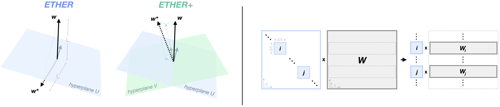

<h1 align="center">
    <p><em>ETHER</em>: Efficient Finetuning of Large-Scale Models with Hyperplane Reflections (ICML2024)</p>
</h1>

<h1 align="center"> 
    
</h1>

Official PyTorch implementation of [**_ETHER_: Efficient Finetuning of Large-Scale Models with Hyperplane Reflections**](https://arxiv.org/abs/2405.20271), M. Bini, K. Roth, Z. Akata, A. Khoreva (ICML 2024)


[Paper](https://arxiv.org/abs/2405.20271) | [Contact](massimo.bini@uni-tuebingen.de) | [Cite](#Citation)


**TLDR:** _ETHER_ and its relaxation _ETHER+_ finetune pretrained models by applying hyperplane reflections on the pretrained weights. Both these metohds show extreme parameter-efficiency (~10-100 times fewer parameters than OFT or LoRA) while demostrating high robustness to learning rate and hyperparameter choices.
- _ETHER_ is the fastest and most parameter-efficient (one vector per finetuned layer)
- _ETHER+_ is the best performant


## Project Structure

This project is split in two separate directories, each of which contains the code and instructions to reproduce the results in the paper:

[`./ether-instruct`](./ether-instruct): code for finetuning Llama2-7B on Instruction Tuning. This is built on top of the [litgpt](https://github.com/Lightning-AI/litgpt) repository, allowing for easy finetuning over a multitude of language models and datasets.

[`./ether-control`](./ether-control): code for finetuning Stable Diffusion on ControlNet-like tasks (s.a. Semantic Map to Image). **[Work in Progress]**


## Best Practices

Choosing the _number of diagonal blocks_ _n_:

**TLDR:** using block-diagonal transformations allows for computational reduction and parallelization in multiplicative finetuning, significantly speeding up training.
In _ETHER_/_ETHER+_ increasing _n_ does not impact the number of training parameters, causing a marginal impact on performance.
- increasing _n_ leads to significant speed-up on models with large hidden dimension 
(e.g. for 4096 of LLama2-7B, compared to 2048 of Phi1.5-1.3B)
- surprisingly, on Llama2-7B Alpaca finetuning, _n_=32 provides overall best results for _ETHER_/_ETHER+_

<table>
  <tr>
    <th>ft method</th>
    <th colspan="2" align="center"><strong>Phi1.5-1.3B</strong></th>
    <th colspan="2" align="center"><strong>Llama2-7B</strong></th>
  </tr>
  <tr>
    <td></td>
    <td align="center">TFLOPs</td>
    <td align="center">rel. drop</td>
    <td align="center">TFLOPs</td>
    <td align="center">rel. drop</td>
  </tr>
  <tr>
    <td><em>ETHER</em><sub>n=1</sub></td>
    <td align="center">9.13</td>
    <td align="center">-</td>
    <td align="center">25.26</td>
    <td align="center">-</td>
  </tr>
  <tr>
    <td><em>ETHER</em><sub>n=4</sub></td>
    <td align="center">7.07</td>
    <td align="center">-23%</td>
    <td align="center">12.07</td>
    <td align="center">-52%</td>
  </tr>
  <tr>
    <td><strong><em>ETHER</em><sub>n=32</sub></strong></td>
    <td align="center"><strong>6.71</strong></td>
    <td align="center"><strong>-27%</strong></td>
    <td align="center"><strong>8.22</strong></td>
    <td align="center"><strong>-68%</strong></td>
  </tr>
  <tr>
    <td><em>ETHER+</em><sub>n=1</sub></td>
    <td align="center">10.78</td>
    <td align="center">-</td>
    <td align="center">51.65</td>
    <td align="center">-</td>
  </tr>
  <tr>
    <td><em>ETHER+</em><sub>n=4</sub></td>
    <td align="center">7.69</td>
    <td align="center">-29%</td>
    <td align="center">18.66</td>
    <td align="center">-64%</td>
  </tr>
  <tr>
    <td><strong><em>ETHER+</em><sub>n=32</sub></strong></td>
    <td align="center"><strong>6.79</strong></td>
    <td align="center"><strong>-37%</strong></td>
    <td align="center"><strong>9.04</strong></td>
    <td align="center"><strong>-83%</strong></td>
  </tr>
  <tr>
    <td>(LoRA<sub>r=8</sub>)</td>
    <td align="center">(6.04)</td>
    <td align="center">-</td>
    <td align="center">(6.85)</td>
    <td align="center">-</td>
  </tr>
</table>


## Visualizations

Qualitative evidence of learning rate robustness (on Subject-driven Generation with Stable Diffusion):

<h1 align="center"> 
    
</h1>

## Acknowledgments
This code repository is based on the implementation of [litgpt](https://github.com/Lightning-AI/litgpt.git)


## Citation
If you find ETHER useful, please consider citing our work:
```bibtex
@misc{bini2024ether,
      title={ETHER: Efficient Finetuning of Large-Scale Models with Hyperplane Reflections}, 
      author={Massimo Bini and Karsten Roth and Zeynep Akata and Anna Khoreva},
      year={2024},
      eprint={2405.20271},
      archivePrefix={arXiv},
      primaryClass={cs.LG}
}
```

## License
This code repository is open-sourced under [MIT license](LICENSE).

